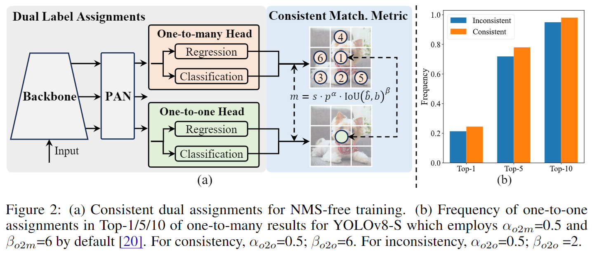
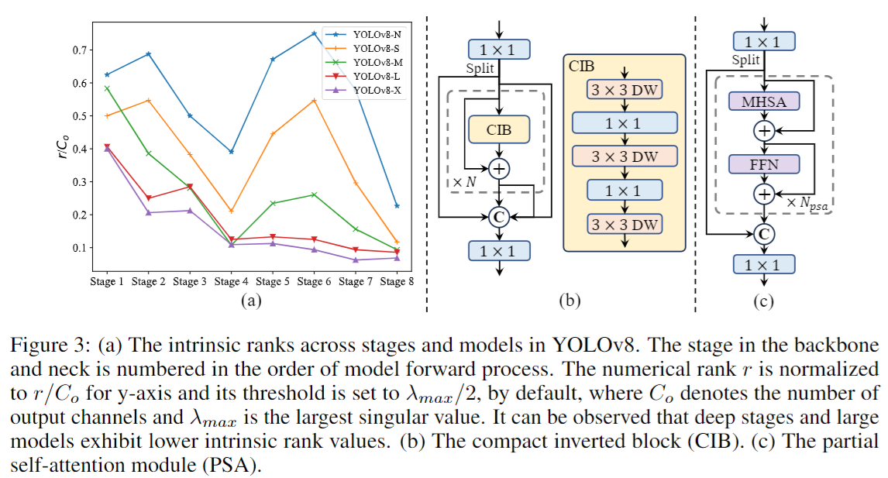

# Abs

当前问题：

* 作者认为NMS导致推理的延迟较大
* YOLO的不同组件缺乏完整的实验，导致计算冗余和模型能力受限

In this work:

* 从后处理和模型结构上进一步优化YOLO

# Intro

## NMS

在避免NMS方面有两个路线：

* 使用DETR系列的检测模型
* 使用CNN-based的模型进行1对1检测

但是这两种方法的速度和精度都略有损失

## 模型结构

backbone的优化包括：

* DarkNet
* CSPNet
* EfficientRep
* ELAN
* GELAN
* ...

neck的优化包括：

* FPN

* PAN 
* BiC
* GD
* RepGFPN
* ...

其它优化包括：

* 模型压缩策略
* 重参数策略

# Method

提出了NMS-free的训练策略，采用**双标签分配（dual label assignments）**和**一致匹配度量(consistent matching metric)**，让模型变得更强。

## dual label assignments

双重标签分配：一对一（one-to-one matching assigns）+ 一对多（one-to-many assignment)

* 一对多：现在的YOLO基本都是一对多，即一个instance是有多个框的，需要经过NMS过滤；
* 一对一：仅为每个instance分配一个框，从而避免了NMS后处理，这会导致弱监督，导致准确率低、训练慢；

结合两者的优缺点，作者提出将这两个融合起来，如下图所示。



在训练过程中，这一对一Head和一对多Head两个头与模型一起进行联合优化，使得backbone和neck能够享受到一对多分配提供的丰富监督。在推理过程中丢弃一对多Head（有点类似v9中推理过程舍弃辅助支路的想法），利用一对一头进行预测。这使得YOLO能够进行端到端部署而不会产生任何额外的推理成本。此外，在一对一匹配中采用了Top-1选择，其性能与匈牙利匹配相同，但训练时间更少。

```python
# ultralytics.utils.loss
class v10DetectLoss:
    def __init__(self, model):
        self.one2many = v8DetectionLoss(model, tal_topk=10)
        self.one2one = v8DetectionLoss(model, tal_topk=1)

    def __call__(self, preds, batch):
        one2many = preds["one2many"]
        loss_one2many = self.one2many(one2many, batch)
        one2one = preds["one2one"]
        loss_one2one = self.one2one(one2one, batch)
        return loss_one2many[0] + loss_one2one[0], torch.cat((loss_one2many[1], loss_one2one[1]))
```


## Consistent matching metric

在标签分配过程中，一对一和一对多方法都利用一种度量标准（损失函数）来定量评估预测与实例之间的一致性水平。为了在这两个分支中实现预测感知匹配，本文的YOLOv10采用了一致匹配度量标准（Consistent matching metric）：

$ m(\alpha,\beta)=s\cdot p^{\alpha}\cdot\mathrm{IoU}(\hat{b},b)^{\beta} $

这里的 $p$ 代表分类得分， $b$ 和 $\hat{b}$ 代表ground truth bounding box和predict bounding box， $s$ 代表空间先验指示，其代表预测的anchor point是否在instance中。$\alpha$ 和 $\beta$ 是用于平衡语义预测任务和位置回归任务的影响的两个超参数。因此，

一对多的度量为：$m_{o2m}=m(\alpha_{o2m},\beta_{o2m})$

一对一的度量为：$m_{o2m}=m(\alpha_{o2m},\beta_{o2m})$

在双重标签分配中，一对多分支提供了比一对一分支更丰富的监督信号。这里如果能够将一对一头的监督与一对多头的监督协调一致，就可以将一对一头优化到一对多头的优化方向，从而使一对一头在推理过程中提升准确度。为此，首先**分析两个头之间的监督差距**。由于训练过程中的随机性，在开始时**对两个头进行相同的初始化**，并产生相同的预测，即一对一头和一对多头为每个predict-instance pair生成相同的 $p$ 和 $\mathrm{IoU}$。作者认为两条分支的回归目标并不冲突，因为匹配的预测共享相同的目标，而未匹配的预测被忽略。因此，**监督差距在于不同的分类目标**。对于一个实例，我们将其与预测的最大 IoU 记为 $u$，将一对多和一对一的最大匹配得分分别记为 $𝑚_{𝑜2𝑚}^*$ 和 $𝑚_{𝑜2o}^*$ 。假设一对多分支产生了正样本集合 $\text{Ω}$，而一对一分支选择了第 $i$ 个预测，并且使用度量 $ m_{o2m} = m_{o2m}^*$，我们可以推导出分类目标(classification target)：

一对多分支分类目标：$t_{o2m,j}=u^{*}\cdot\frac{m_{o2m,j}}{m_{o2m}^{*}}\leq u^{*}$       $ \mathrm{for}$   $ j\in\Omega $

一对一分支分类目标：$t_{o2o,j}=u^{*}\cdot\frac{m_{o2o,j}}{m_{o2o}^{*}}\leq u^{*}$   

两个分支之间的差异监督可以由不同分类目标1-Wasserstein距离得出，即：

$A=t_{o2o,i}-\mathbb{I}(i\in\Omega)t_{o2m,i}+\sum_{k\in\Omega\setminus\{i\}}t_{o2m,k}$

可以观测到gap随着 $t_{o2o,i}$ 的增大而降低，例如 $i$ 在 Ω 中排名较高。当 $t_{o2m,i}=u^*$ 时，即 $i$ 是 Ω 中最佳的正样本时，差距达到最小。为了实现这一点，提出了一致的匹配度量，即 $𝛼_{𝑜2𝑜}=𝑟⋅𝛼_{𝑜2𝑚}$ 和 $𝛽_{𝑜2𝑜}=𝑟⋅𝛽_{𝑜2𝑚}$，这意味着 $m_{o2o}=m_{o2m}^{r}$。因此，对于一对多头而言，最佳的正样本也是一对一头的最佳样本，两个头可以一致且和谐地进行优化。为了简化，默认取 $ 𝑟=1$ 。为验证改进的监督对齐，作者在训练后计算了在一对多结果的Top-1/5/10中的一对一匹配对的数量，对齐性得到了改善。

---

这里先放上dual label assignments的实验结果：

| o2m  | o2o  |  AP  | Latency |
| :--: | :--: | :--: | :-----: |
|  ✓   |      | 44.9 |  7.07   |
|      |  ✓   | 43.4 |  2.44   |
|  ✓   |  ✓   | 44.3 |  2.44   |

从作者的实验来看使用一对一的Head最终精度掉点不多，但是速度提升好多。

| $α_{o2o}$ | $β_{o2o}$ | $\text{AP}^{val}$ | $α_{o2o}$ | $β_{o2o}$ | $\text{AP}^{val}$ |
| --------- | --------- | ----------------- | --------- | --------- | ----------------- |
| 0.5       | 2.0       | 42.7              | **0.25**  | **3.0**   | **44.3**          |
| 0.5       | 4.0       | 44.2              | 0.25      | 6.0       | 43.5              |
| **0.5**   | **6.0**   | **44.3**          | 1.0       | 6.0       | 43.9              |
| 0.5       | 8.0       | 44.0              | **1.0**   | **12.0**  | **44.3**          |


## 模型结构

### Efficiency driven model design

效率驱动的模型设计。YOLO中的组件包括干部（stem）、下采样层（downsampling layers）、具有基本构建块的阶段（stages with basic building blocks）和头部（head）。干部的计算成本很少，因此针对其他三个部分进行了效率驱动的模型设计。

#### **(1) 轻量级分类Head**

在YOLO中，分类头和回归头通常共享相同的架构。然而，它们在计算开销上存在明显差异。例如，在YOLOv8-S中，分类头的浮点运算数（FLOPs）和参数数量（1.51M）分别是回归头的2.5倍和2.4倍（FLOPs为5.95G，参数数量为0.64M）。然而，在分析分类错误和回归错误的影响后（见表6），我们发现回归头对YOLO的性能具有更大的影响。因此，我们可以在不太担心极大损害性能的情况下减少分类头的开销。因此，我们简单地为分类头采用了轻量级架构，由两个3×3的深度可分离卷积和一个1×1卷积组成。

```python
# 这里简单回顾一下v8s的Head部分(cv2和cv3)
class Detect(nn.Module):
    """YOLOv8 Detect head for detection models."""
	...

    def __init__(self, nc=80, ch=()):
        """Initializes the YOLOv8 detection layer with specified number of classes and channels."""
        super().__init__()
        ...
        c2, c3 = max((16, ch[0] // 4, self.reg_max * 4)), max(ch[0], min(self.nc, 100)) 
        # cv2: 边界框回归Head, backbone在PAN输出的三个特征图每个特征图都经过三个卷积层计算得到回归值
        self.cv2 = nn.ModuleList(nn.Sequential(Conv(x, c2, 3), Conv(c2, c2, 3), nn.Conv2d(c2, 4 * self.reg_max, 1)) for x in ch)
        # cv3: 分类Head，backbone在PAN输出的三个特征图每个特征图都经过三个卷积层计算得到分类值
        self.cv3 = nn.ModuleList(nn.Sequential(Conv(x, c3, 3), Conv(c3, c3, 3), nn.Conv2d(c3, self.nc, 1)) for x in ch)
        self.dfl = DFL(self.reg_max) if self.reg_max > 1 else nn.Identity()

    def forward(self, x):
        """Concatenates and returns predicted bounding boxes and class probabilities."""
        # 假如输入是640*640尺寸图片,这里x shape:[torch.Size([1, 320, 80, 80]), torch.Size([1, 640, 40, 40]), torch.Size([1, 640, 20, 20])]
        for i in range(self.nl):
            x[i] = torch.cat((self.cv2[i](x[i]), self.cv3[i](x[i])), 1)
        if self.training:  # Training path
            return x

        # Inference path
		...
        
"""
说明:
——————————————————————————————————————————————
这里的边界框回归Head：
c_out = 4 * self.reg_max
c2 = max(16, ch[0] // 4, c_out)
Conv(c_in, c2, 3) -> Conv(c2, c2, 3) ->nn.Conv2d(c2, c_out, 1)
由于c_in固定, 这里c_out由于回归的box仅需要x,y,w,h即可定位边界框所以值也偏小,即模型中卷积层的通道数量较小，最终导致回归Head部分参数量小,推理速度更快。
——————————————————————————————————————————————
这里的分类Head：
在预设coco数据集下, self.nc=80类别
c3 = max(ch[0], min(self.nc, 100)) 
Conv(x, c3, 3) —> Conv(c3, c3, 3), nn.Conv2d(c3, self.nc, 1)
由于类别量一般比较大，所以导致分类Head需要更多的通道去计算类别，导致参数量大，推理速度更慢。因此YOLOv10作者提出使用两个3x3的DWConv替换
"""
```

#### (2) 空间-通道解耦下采样

YOLO系列通常使用kernel_size=(3×3)，stride=2 的nn.Conv2d（配合BN和SiLU），同时实现空间下采样（高和宽除以2）和通道转换（通道乘以2）。其中包含计算成本 $\mathcal{O}(\frac92HWC^2)$ 和参数量 $\mathcal{O}(18C^2)$。作者提出将空间降维和通道增加操作解耦：**首先利用逐点卷积调整通道维度，然后使用深度卷积进行空间下采样。**这将计算量降低到 $\mathcal{O}(2HWC^2+\frac92HWC)$ ，参数数量降低到$\mathcal{O}(2C^2+18)$

```python
"""
将原本的Conv替换为New_Conv
"""
# 原本的CBS模块（Conv模块）:
Conv = nn.Sequential([nn.Conv2d(c_in, c_in/2, stride=2), nn.BatchNorm2d(), nn.SiLU()])
# 替换为:
# 逐点卷积是1x1卷积核，不改变WH仅调整C
pointwise = nn.Conv2d(in_c, c_in/2, kernel_size=1) 
# 深度卷积一般不改变通道，仅改变HW
depthwise = nn.Conv2d(c_in/2, c_in/2, stride=2, groups=c_in/2) 
New_Conv = nn.Sequential([pointwise, depthwise, nn.BatchNorm2d(), nn.SiLU()])
# 这种pointwise+depthwise的方法其实最早在MobileNet就提出了,并非v10原创
```

#### (3) rank-guided的block设计

YOLO系列通常在所有阶段使用相同的基本构建块，例如YOLOv8中的BottleNeck block。为了全面检查YOLOs这种同质化设计，利用固有rank来分析每个阶段的冗余性（rank越低，冗余越大; rank越高，信息越浓缩）。具体来说，通过计算每个阶段最后一个基本块中的最后一个卷积的数值秩（没明白这里说的是计算卷积核矩阵的秩还是输出特征图的秩，后面核对一下代码），这个数值秩表示大于某个阈值的奇异值（Singular Values）的数量(这里提到的奇异值数量=矩阵的秩是可以推导的结论，因为奇异值分解可将矩阵分解：$A=U\Sigma V^*$，这里$\Sigma$主对角元素就是奇异值)。下图展示了YOLOv8的结果，表明深层阶段和大模型更容易表现出更多的冗余性。这一观察表明，简单地为所有阶段应用相同的块设计对于最佳的容量-效率权衡来说是次优的。为了解决这个问题，提出了一种rank引导的块设计方案，旨在通过紧凑的架构设计减少被证明冗余的阶段的复杂性。



作者首先**提出了一种紧凑的反向块（Compact Inverted Block，CIB）**结构，它采用depthwise+pointwise构成，如图3.(b)所示。它可以作为高效的基本构建块，例如嵌入到ELAN结构中（图3.(b)）。然后提出一种**rank引导的块分配策略**，以实现最佳的效率同时保持竞争性容量。具体来说，给定一个模型，我们根据其所有阶段的固有秩按升序对其进行排序，进一步检查替换主导阶段中的基本块与CIB的性能变化，如果与给定模型相比没有性能下降，继续替换下一个阶段，否则停止该过程。因此，我们可以实现跨阶段和模型规模的自适应紧凑块设计，实现更高的效率而不损害性能。

### Accuracy driven model design

精度驱动模型设计：

#### **(1) 大核卷积**

使用更大卷积核的DWConv是一种有效的方法，可以扩大感受野并增强模型的能力。然而，简单地在所有阶段使用大核卷积可能会在用于检测小物体的浅层特征中引入干扰，同时在高分辨率阶段引入显著的I/O开销和延迟。因此，提出在CIB的深层阶段中使用大核深度卷积。具体来说，将CIB中第二个3×3DWConv的卷积核大小增加到7×7。此外，采用结构重参数化技术引入另一个3×3深度卷积分支，以缓解优化问题而不增加推理开销。此外，随着模型规模的增加，其感受野自然扩展，使用大核卷积的好处减少。因此，我们仅在小模型规模中采用大核卷积。

```bash
小规模模型适合在模型中后端使用大卷积核；大规模模型适合用小一些的卷积核
```

#### (2) 局部自注意力（Partial Self Attention, PSA）

Self Attention虽然有显著的全局建模能力，但代价是较高的计算复杂度和内存占用。考虑到普遍存在的Attention Head冗余，作者提出了一种高效的局部自注意力（PSA）模块设计，如图3.(c)所示。具体来说，在1×1卷积之后，将特征在通道上均匀地分成两部分(split(dim=1))。将一部分输入到MHSA和FFN。然后将两部分**连接**(这里的连接不确定是加法还是concat，需要看一下代码)起来并通过1×1卷积融合。此外，遵循【21】将查询和键的维度分配为值的一半，并用BatchNorm【26】替换LayerNorm【1】以加快推理速度。此外，PSA仅放置在分辨率最低的Stage 4之后，避免了自注意力平方计算复杂度带来的过多开销。通过这种方式，可以在较低计算成本下将全局表示学习能力引入YOLO，从而增强模型的能力并提高性能。

# 部分实验

详细实验参考论文原文，部分实验内容如下：

## 对比实验

表中 $\textbf{Latency}$ 代表包含后处理的推理时间，$\textbf{Latency}^{\textbf{f}}$ 代表不包含后处理的推理时间。

| Model            | #Param.(M) | FLOPs(G) | $\textbf{AP}^{\textbf{val}}$(%) | Latency(ms) | $\textbf{Latency}^{\textbf{f}}$(ms) |
| ---------------- | ---------- | -------- | ------------------------------- | ----------- | ----------------------------------- |
| **Nano model** |  |  |  |  |  |
| YOLOv8-N    | 3.2        | 8.7      | 37.3                            | 6.16        | 1.77                                |
| YOLOv10-N | 2.3        | 6.7      | 38.5 / 39.5†                    | **1.84**    | 1.79                                |
| **Small model** |            |          |                                 |             |                                     |
| Gold-YOLO-S | 21.5       | 46.0     | 45.4                            | 3.82        | 2.73                                |
| YOLOv8-S    | 11.2       | 28.6     | 44.9                            | 7.07        | 2.33                                |
| YOLOv9-S    | 7.1        | 26.4     | 46.7                            | -           | -                                   |
| RT-DETR-R18 | 20.0       | 60.0     | 46.5                            | 4.58        | 4.49                                |
| YOLOv10-S | 7.2        | 21.6     | 46.3 / 46.8†                    | **2.49**    | 2.39                                |
| **Medium model** |  |  |  |  |  |
| YOLOv6-3.0-M | 34.9 | 85.8  | 49.1         | 5.63  | 4.56  |
| Gold-YOLO-M  | 41.3 | 87.5  | 49.8         | 6.38  | 5.45  |
| YOLO-MS       | 22.2 | 80.2  | 51.0         | 12.41 | 7.30  |
| YOLOv8-M     | 25.9 | 78.9  | 50.6         | 9.50  | 5.09  |
| YOLOv9-M     | 20.0 | 76.3  | 51.1         | -     | -     |
| RT-DETR-R34  | 31.0 | 92.0  | 48.9         | 6.32  | 6.21  |
| RT-DETR-R50m | 36.0 | 100.0 | 51.3         | 6.90  | 6.84  |
| YOLOv10-M  | 15.4 | 59.1  | 51.1 / 51.3† | **4.74** | 4.63  |
| **Large model** |  |  |  |  |  |
| YOLOv6-3.0-L | 59.6 | 150.7 | 51.8         | 9.02  | 7.90  |
| Gold-YOLO-L  | 75.1 | 151.7 | 51.8         | 10.65 | 9.78  |
| YOLOv9-C     | 25.3 | 102.1 | 52.5         | 10.57 | 6.13  |
| YOLOv10-B  | 19.1 | 92.0  | 52.5 / 52.7† | 5.74  | 5.67  |
| YOLOv8-L     | 43.7 | 165.2 | 52.9         | 12.39 | 8.06  |
| RT-DETR-R50  | 42.0 | 136.0 | 53.1         | 9.20  | 9.07  |
| YOLOv10-L  | 24.4 | 120.3 | 53.2 / 53.4† | **7.28** | 7.21  |
| **Exlarge model** |  |  |  |  |  |
| YOLOv8-X     | 68.2 | 257.8 | 53.9         | 16.86 | 12.83 |
| RT-DETR-R101 | 76.0 | 259.0 | 54.3         | 13.71 | 13.58 |
| YOLOv10-X  | 29.5 | 160.4 | 54.4 / 54.4† | **10.70** | 10.60 |

## 扩展消融

|      Model       |  #Param   |   FLOPs   | $\textbf{AP}^{\textbf{val}}$(%) |  Latency  |
| :--------------: | :-------: | :-------: | :-----------------------------: | :-------: |
|     原始模型     | 11.2/25.9 | 28.6/78.9 |            44.3/50.3            | 2.44/5.22 |
| +轻量化分类Head  | 9.9/23.2  | 23.5/67.7 |            44.2/50.2            | 2.39/5.07 |
| +下采样（DW+PW） | 8.0/19.7  | 22.2/65.0 |            44.4/50.4            | 2.36/4.97 |
|       +CIB       | 6.2/14.1  | 20.8/58.1 |            44.5/50.4            | 2.31/4.57 |